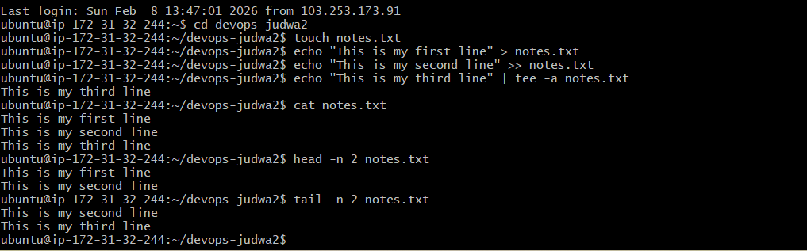

# Day 06 – Linux Fundamentals: Read and Write Text Files

## Objective

Practice basic file input/output operations using fundamental Linux commands.

---

## File Created

* `notes.txt`

---

## Commands Practiced & Explanation

```bash
touch notes.txt
```

Creates an empty file named `notes.txt`.

```bash
echo "This is my first line" > notes.txt
```

Writes the first line to the file (overwrites if file already exists).

```bash
echo "This is my second line" >> notes.txt
```

Appends a second line to the file without overwriting existing content.

```bash
echo "This is my third line" | tee -a notes.txt
```

Displays the line on the terminal and appends it to the file at the same time.

```bash
cat notes.txt
```

Displays the full contents of the file.

```bash
head -n 2 notes.txt
```

Shows the first two lines of the file.

```bash
tail -n 2 notes.txt
```

Shows the last two lines of the file.

---

## Proof of Execution



*(Screenshot shows file creation, writing, appending, and reading operations performed on the system.)*

---

## Summary

* Successfully created and modified a text file
* Practiced overwrite vs append using `>` and `>>`
* Used `tee` for simultaneous output and write
* Read full and partial file contents using `cat`, `head`, and `tail`

This exercise builds confidence with basic Linux file operations and redirection.
