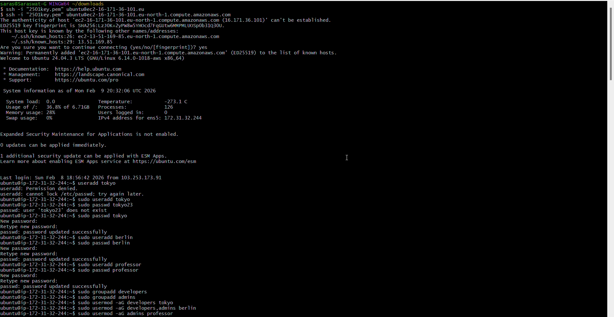
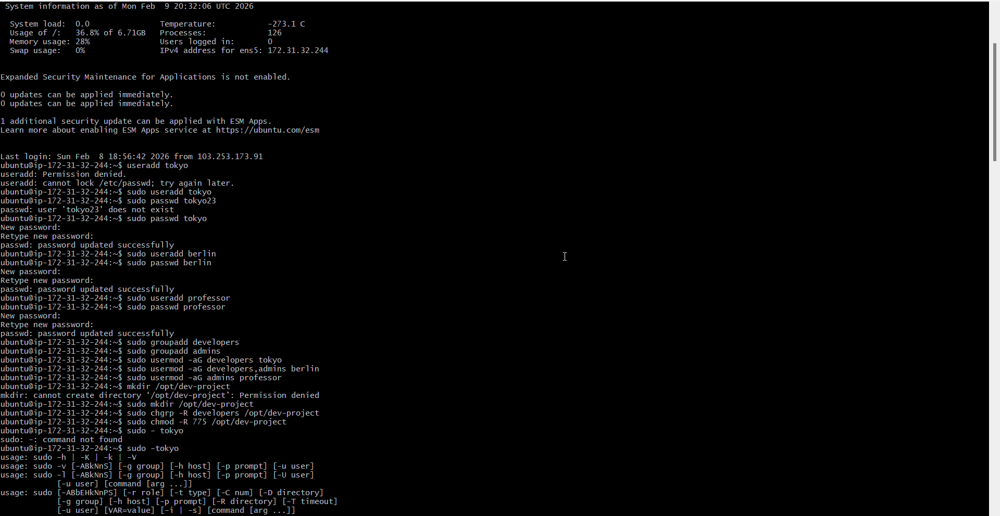
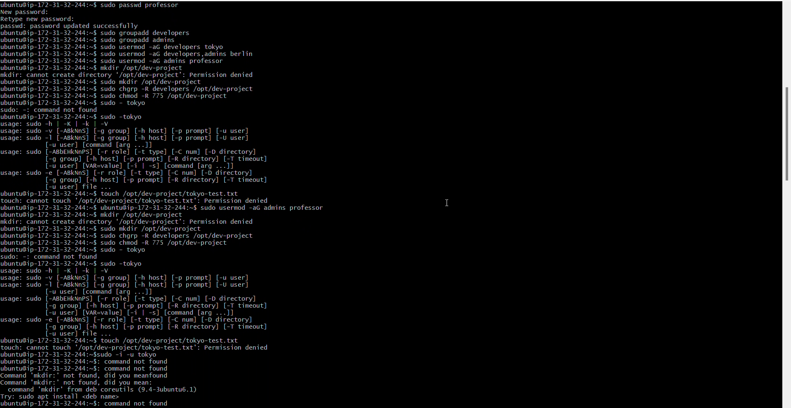

# Day 09 Challenge – User & Group Management

## Users & Groups Created
- Users: tokyo, berlin, professor, nairobi
- Groups: developers, admins, project-team

## Group Assignments
- tokyo → developers, project-team
- berlin → developers, admins
- professor → admins
- nairobi → project-team

## Directories Created
- /opt/dev-project → group: developers, permissions: 775
- /opt/team-workspace → group: project-team, permissions: 775

## Commands Used
```bash
sudo useradd -m tokyo
sudo useradd -m berlin
sudo useradd -m professor
sudo useradd -m nairobi

sudo passwd tokyo
sudo passwd berlin
sudo passwd professor
sudo passwd nairobi

sudo groupadd developers
sudo groupadd admins
sudo groupadd project-team

sudo usermod -aG developers tokyo
sudo usermod -aG developers,admins berlin
sudo usermod -aG admins professor
sudo usermod -aG project-team tokyo
sudo usermod -aG project-team nairobi

sudo mkdir /opt/dev-project
sudo chgrp developers /opt/dev-project
sudo chmod 775 /opt/dev-project

sudo mkdir /opt/team-workspace
sudo chgrp project-team /opt/team-workspace
sudo chmod 775 /opt/team-workspace
```

## Verification Screenshots

### User & Group Creation


### Shared Directory Test


### Team Workspace Test


## What I Learned
- Linux user and group management is foundational for access control
- Group permissions enable safe collaboration
- Testing as real users validates permission setups
