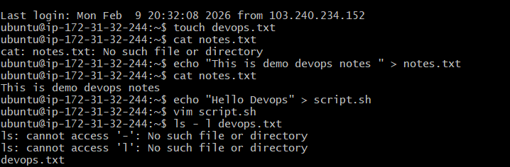
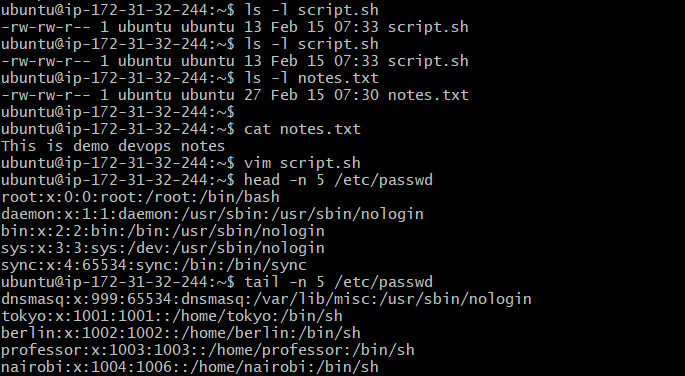
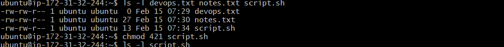
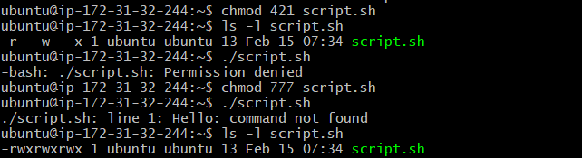

# Day 10 Challenge – File Permissions

---

# Task 1: Create Files (10 minutes)

## Task Requirements
- Create empty file `devops.txt` using touch
- Create `notes.txt` with content
- Create `script.sh` using vim with content: echo "Hello DevOps"
- Verify using `ls -l`

---

## What I Did

### Created devops.txt

Command:
`touch devops.txt`

---

### Created notes.txt

Command:
`echo "This is demo devops notes" > notes.txt`

Verified:
`cat notes.txt`

Output:
This is demo devops notes

---

### Created script.sh

Command:
`echo "Hello Devops" > script.sh`
`vim script.sh`

---

### Verified Permissions

Command:
`ls -l devops.txt notes.txt script.sh`

Output:
-rw-rw-r-- 1 ubuntu ubuntu  0 devops.txt  
-rw-rw-r-- 1 ubuntu ubuntu 27 notes.txt  
-rw-rw-r-- 1 ubuntu ubuntu 13 script.sh  

---

## Screenshot Proof

---

# Task 2: Read Files (10 minutes)

## Task Requirements
- Read notes.txt using cat
- View script.sh in vim read-only mode
- Display first 5 lines of /etc/passwd
- Display last 5 lines of /etc/passwd

---

## What I Did

### Read notes.txt

Command:
`cat notes.txt`

Output:
This is demo devops notes

---

### Viewed first 5 lines of /etc/passwd

Command:
`head -n 5 /etc/passwd`

Output:
`root:x:0:0:root:/root:/bin/bash  
daemon:x:1:1:daemon:/usr/sbin:/usr/sbin/nologin  
bin:x:2:2:bin:/bin:/usr/sbin/nologin  
sys:x:3:3:sys:/dev:/usr/sbin/nologin  
sync:x:4:65534:sync:/bin:/bin/sync` 

---

### Viewed last 5 lines of /etc/passwd

Command:
`tail -n 5 /etc/passwd`

Output:
`dnsmasq:x:999:65534:dnsmasq:/var/lib/misc:/usr/sbin/nologin  
tokyo:x:1001:1001::/home/tokyo:/bin/sh  
berlin:x:1002:1002::/home/berlin:/bin/sh  
professor:x:1003:1003::/home/professor:/bin/sh  
nairobi:x:1004:1006::/home/nairobi:/bin/sh ` 

---

## Screenshot Proof

---

# Task 3: Understand Permissions (10 minutes)

## Task Requirement

Format: rwxrwxrwx (owner-group-others)

r = 4  
w = 2  
x = 1  

---

## Checked Current Permissions

Command:
`ls -l devops.txt notes.txt script.sh`

Output:
`-rw-rw-r--  devops.txt  
-rw-rw-r--  notes.txt  
-rw-rw-r--  script.sh`  

---

## Explanation

Owner → Read + Write  
Group → Read + Write  
Others → Read only  
No execute permission  

---

## Screenshot Proof

---

# Task 4: Modify Permissions (20 minutes)

## 1. Changed script.sh to 421

Command:
`chmod 421 script.sh`

Result:
-r---w---x

Attempted execution:
`./script.sh`

Error:
Permission denied

Reason:
Owner did not have execute permission.

---

## 2. Changed script.sh to 777

Command:
`chmod 777 script.sh`

Result:
`-rwxrwxrwx`

Executed:
`./script.sh`

Error:
`./script.sh: line 1: Hello: command not found`

Reason:
`Script content was incorrect (missing echo command).`

---

## 3. Made devops.txt Read-Only

Command:
`chmod 555 devops.txt`

Result:
`-r-xr-xr-x`

Tried writing:
`echo "This is new line" >> devops.txt`

Error:
`Permission denied`

---

## 4. Changed notes.txt to 640

Command:
`chmod 640 notes.txt`

Result:
`-rw-r-----`

Owner → Read + Write  
Group → Read  
Others → No access  

---

## 5. Created project directory

Command:
`mkdir project`

(Recommended)
`chmod 755 project`

---

## Screenshot Proof

---

# Task 5: Test Permissions (10 minutes)

## Tested Writing to Read-Only File

Command:
`echo "This is new line" >> devops.txt`

Error:
`Permission denied`

---

## Tested Executing Without Execute Permission

Command:
`./script.sh`

Error:
`Permission denied`

---

## Screenshot Proof

()

---

# What I Learned

1. Linux permissions are divided into Owner, Group, Others.
2. Numeric system (r=4, w=2, x=1) controls permission logic.
3. A script needs execute permission AND valid command inside.
4. Removing write permission prevents file modification.
5. Incorrect permissions cause real production errors.
