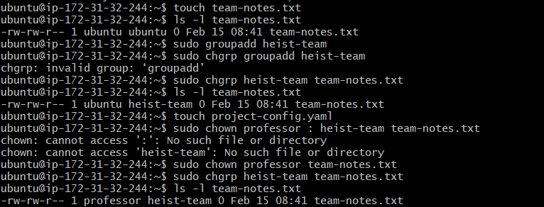
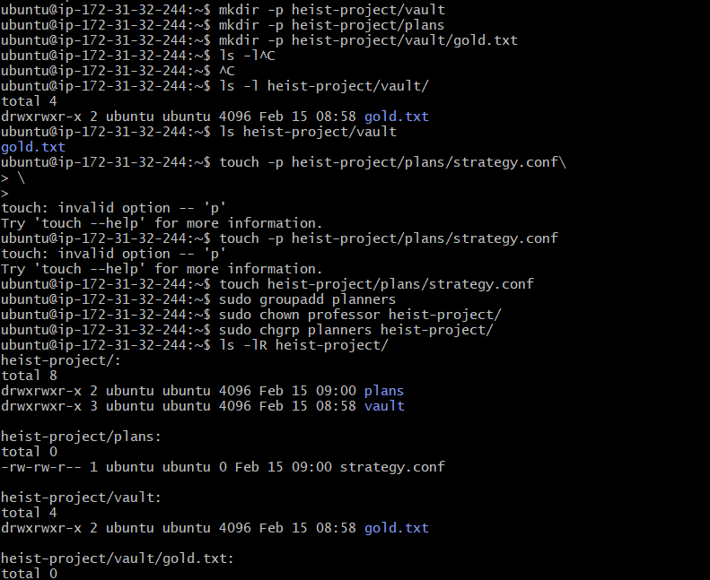

# Day 11 Challenge – File Ownership

---

# Task 1: Understanding Ownership

## What I Did

Ran:

`ls -l`

Observed format:

`-rw-r--r-- 1 owner group size date filename`

Example:

`-rw-rw-r-- 1 ubuntu ubuntu 0 Feb 15 devops.txt`

### Owner Column
The first name after permission bits represents the **file owner (user)**.

### Group Column
The second name represents the **group owner** of the file.

## Screenshot Proof

---

## Difference Between Owner and Group

- **Owner** → The specific user who owns the file. Has primary control.
- **Group** → A collection of users who may share certain permissions.
- Owner permissions apply only to that user.
- Group permissions apply to all users belonging to that group.

---

# Task 2: Basic chown Operations

## Files Created

`touch devops-file.txt`

Checked ownership:

`ls -l devops-file.txt`

Initial:

`ubuntu ubuntu`

Changed owner to tokyo:

`sudo chown tokyo devops-file.txt`

Changed owner to berlin:

`sudo chown berlin devops-file.txt`

Verified:

`ls -l devops-file.txt`

---

# Task 3: Basic chgrp Operations

## File Created

`touch team-notes.txt`

Checked group:

`ls -l team-notes.txt`

Created group:

`sudo groupadd heist-team`

Changed group:

`sudo chgrp heist-team team-notes.txt`

Verified:

`ls -l team-notes.txt`

## Screenshot Proof

---

# Task 4: Combined Owner & Group Change

## File Created

`touch project-config.yaml`

Changed owner and group together:

`sudo chown professor:heist-team project-config.yaml`

Verified:

`ls -l project-config.yaml`

---

## Directory Created

`mkdir app-logs/`

Changed ownership:

`sudo chown berlin:heist-team app-logs/`

Verified:

`ls -l`

---

# Task 5: Recursive Ownership

## Directory Structure Created

`mkdir -p heist-project/vault`  
`mkdir -p heist-project/plans`  

`touch heist-project/vault/gold.txt` 
`touch heist-project/plans/strategy.conf` 

Created group:

`sudo groupadd planners`

Changed entire directory ownership recursively:

`sudo chown -R professor:planners heist-project/`

Verified:

`ls -lR heist-project/`

All subdirectories and files updated successfully.

## Screenshot Proof

---

# Task 6: Practice Challenge

## Users Created (if not existing)

`sudo useradd tokyo`  
`sudo useradd berlin`  
`sudo useradd nairobi` 

## Groups Created

`sudo groupadd vault-team`  
`sudo groupadd tech-team` 

## Directory Created

`mkdir bank-heist/`

## Files Created

`touch bank-heist/access-codes.txt`  
`touch bank-heist/blueprints.pdf`  
`touch bank-heist/escape-plan.txt`  

---

## Ownership Set

access-codes.txt:

`sudo chown tokyo:vault-team bank-heist/access-codes.txt`

blueprints.pdf:

`sudo chown berlin:tech-team bank-heist/blueprints.pdf`

escape-plan.txt:

`sudo chown nairobi:vault-team bank-heist/escape-plan.txt`

Verified:

`ls -l bank-heist/`

## Screenshot Proof

---

# Files & Directories Created

- devops-file.txt
- team-notes.txt
- project-config.yaml
- app-logs/
- heist-project/
- heist-project/vault/gold.txt
- heist-project/plans/strategy.conf
- bank-heist/
- bank-heist/access-codes.txt
- bank-heist/blueprints.pdf
- bank-heist/escape-plan.txt

---

# Ownership Changes (Before → After)

- devops-file.txt: ubuntu:ubuntu → tokyo → berlin
- team-notes.txt: ubuntu:ubuntu → ubuntu:heist-team
- project-config.yaml: ubuntu:ubuntu → professor:heist-team
- app-logs/: ubuntu:ubuntu → berlin:heist-team
- heist-project/: ubuntu:ubuntu → professor:planners (recursive)
- access-codes.txt: ubuntu:ubuntu → tokyo:vault-team
- blueprints.pdf: ubuntu:ubuntu → berlin:tech-team
- escape-plan.txt: ubuntu:ubuntu → nairobi:vault-team

---

# Commands Used

`ls -l  
touch  
mkdir -p  
sudo useradd  
sudo groupadd  
sudo chown  
sudo chgrp  
sudo chown -R` 

---

# What I Learned

1. File ownership consists of two parts: user (owner) and group.
2. `chown` can change both owner and group in one command using owner:group format.
3. Recursive flag (-R) is required to change ownership of directories and all their contents.
4. User and group must exist before assigning ownership.
5. Ownership is different from permissions but works together for access control.
