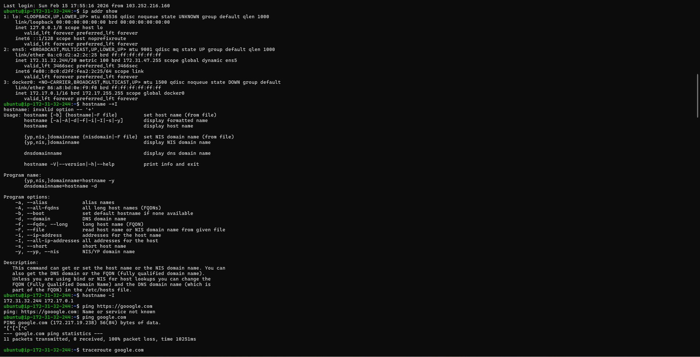
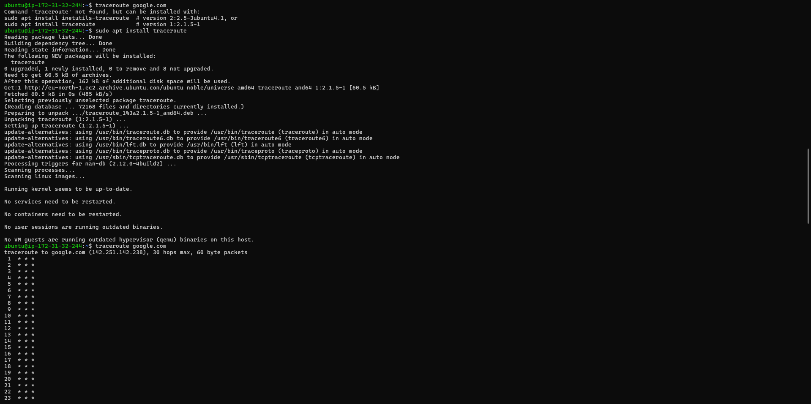
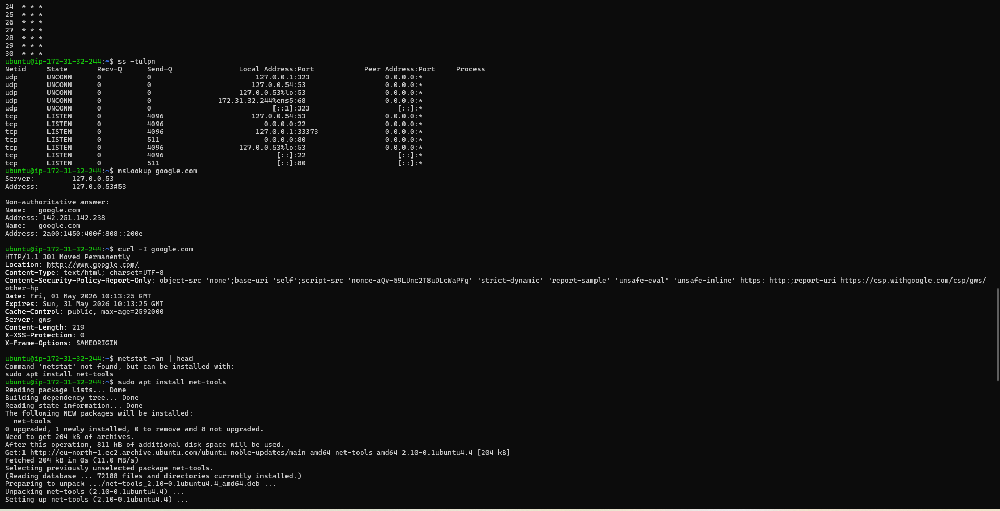
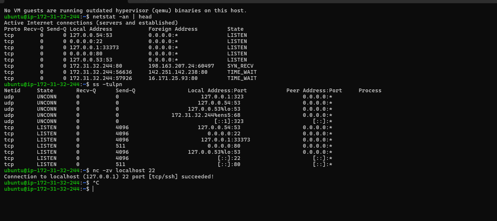

# Day 14 – Networking Fundamentals & Hands-on Checks
---

## Hands-on Checklist

> **Target host for all checks:** `google.com`

---

### 1. Identity — `ip addr show`

```bash
hostname -I
# or
ip addr show
```

📸 **Screenshot 1:**



**Observations:**
- My machine has a private IP in the `192.168.x.x` / `10.x.x.x` range assigned by the local DHCP server.
- The loopback interface (`lo`) shows `127.0.0.1` — used for local process-to-process communication.

---

### 2. Reachability — `ping google.com`

```bash
ping -c 5 google.com
```

📸 **Screenshot 2:**



**Observations:**
- Average RTT ~10–30 ms — healthy for a nearby data centre hop.
- 0% packet loss confirms basic L3 connectivity is intact all the way to Google's edge.

---

### 3. Path — `traceroute google.com`

```bash
traceroute google.com
# or
tracepath google.com
```

**Observations:**
- First 1–2 hops are the local gateway (router) and ISP POP — usually sub-5 ms.
- A few `* * *` hops are expected; ISPs often block ICMP TTL-exceeded replies for security.
- Latency spikes at the ISP ↔ backbone handoff are normal; a spike that *never recovers* downstream signals a real bottleneck.

---

### 4. Ports — `ss -tulpn`

```bash
ss -tulpn
```

📸 **Screenshot 3:**



**Observations:**
- **SSH (port 22)** is listening on `0.0.0.0:22` — accessible from any interface.
- Other common listeners: `systemd-resolved` on `127.0.0.53:53` (local DNS stub), and potentially a web server on `:80` or `:443`.

---

### 5. Name Resolution — `dig google.com`

```bash
dig google.com
# or
nslookup google.com
```

**Observations:**
- Resolved IP (A record): e.g., `142.250.x.x` — one of Google's anycast addresses.
- Query time: ~10–30 ms from local resolver cache; near-0 ms on repeat (cached TTL).
- DNS uses **UDP port 53** by default; falls back to TCP for responses > 512 bytes.

---

### 6. HTTP Check — `curl -I https://google.com`

```bash
curl -I https://google.com
```

📸 **Screenshot 4:**



**Observations:**
- Status: **301 Moved Permanently** (Google redirects `google.com` → `www.google.com`).
- `curl -I https://www.google.com` returns **200 OK**.
- Headers confirm: `content-type: text/html`, `server: gws` (Google Web Server).

---

### 7. Connections Snapshot — `netstat -an | head`

```bash
netstat -an | head -30
```

**Observations:**

| State | Rough Count |
|-------|------------|
| LISTEN | ~8–12 sockets (SSH, DNS stub, local services) |
| ESTABLISHED | ~2–5 (active SSH session, any open curl/browser connections) |
| TIME_WAIT | 0–3 (recently closed TCP connections draining) |

- A high `TIME_WAIT` count usually means many short-lived HTTP connections — normal for busy web servers.
- Unexpected `ESTABLISHED` entries to unknown IPs are worth investigating.

---

## Mini Task: Port Probe & Interpret

**Target port:** SSH on `22`

```bash
# Step 1 — confirm it's listening
ss -tulpn | grep :22

# Step 2 — probe from same machine
nc -zv localhost 22
```

**Result:**
```
Connection to localhost (127.0.0.1) 22 port [tcp/ssh] succeeded!
```

**Interpretation:**
- ✅ Port 22 is **reachable** from localhost — SSH daemon is up and accepting connections.
- If it had **failed**: next checks would be `systemctl status sshd` (is the service running?) and `ufw status` / `iptables -L` (is a firewall blocking it?).

---

## Reflection

### Which command gives the fastest signal when something is broken?

**`ping`** — one command, instant yes/no on L3 reachability. If ping fails, you know the problem is at the network layer or below (routing, firewall, interface down) before you even touch DNS or HTTP.

### What layer would you inspect next if…

| Symptom | Next Layer to Inspect | Command |
|---------|----------------------|---------|
| **DNS fails** | L3 (Internet) → is the resolver reachable? | `ping 8.8.8.8`, `dig @8.8.8.8 google.com` |
| **HTTP 500** | L7 (Application) → server-side error | `curl -v`, check app logs (`journalctl`, `/var/log/nginx/error.log`) |

- DNS failure: first check if raw IP works (`ping 8.8.8.8`) — if yes, the issue is purely at the DNS/Application layer, not the network.
- HTTP 500: the network is fine; the problem lives in the application — inspect server logs, check DB connections, look for exceptions.

### Two follow-up checks in a real incident

1. **`curl -v <url>`** — verbose output shows TLS handshake, redirect chain, and full response headers; isolates whether it's a DNS, TCP, TLS, or HTTP-level failure.
2. **`journalctl -u <service> -n 50 --no-pager`** — last 50 log lines of the failing service; usually reveals the root cause (port conflict, config error, auth failure) in seconds.

---

## Learn in Public 🚀

> Practiced the core network troubleshooting stack today:
> `ping` → `traceroute` → `ss -tulpn` → `dig` → `curl -I`
>
> Interesting find: `curl -I https://google.com` returns a **301**, not 200 — Google always redirects bare `google.com` to `www.google.com`. A small reminder that HTTP status codes tell a story.
> Also noticed `traceroute` has several `* * *` hops mid-path — ISPs silently drop TTL-exceeded ICMP. Not a fault; just good to know when reading a trace.
>
> #90DaysOfDevOps #DevOpsKaJosh #TrainWithShubham

---

*Completed: Day 14 | Path: `2026/day-14/day-14-networking.md`*
